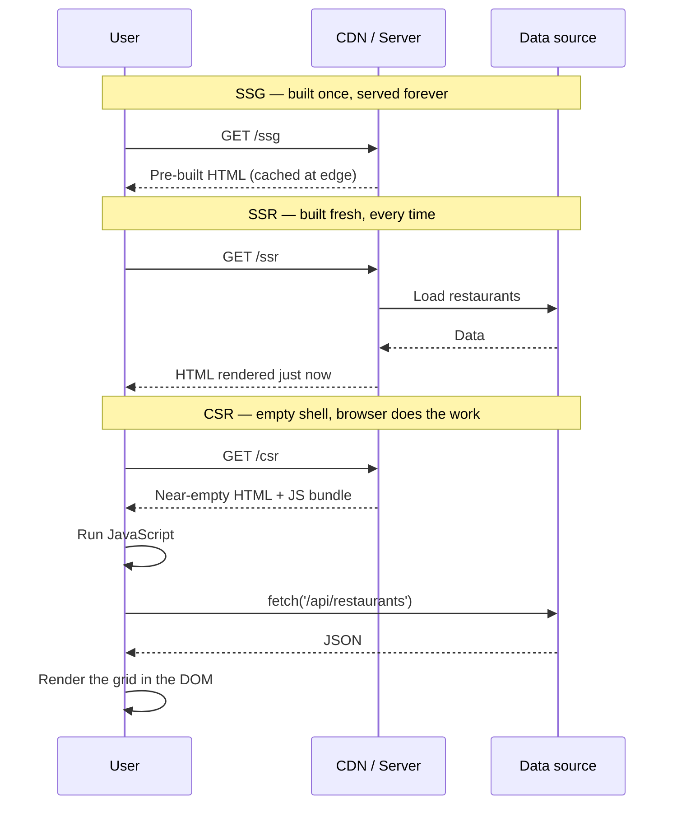

# Demos 7, 8 & 8.5 — SSG, SSR, CSR, hydration, and client-side routing

The same Swiggy restaurant grid, shipped three radically different ways. In one route the HTML is baked at build time and frozen for every visitor. In another, the server rebuilds it from scratch on every request. In a third, the server gives up and lets your browser do the work after the page has already loaded. Same pixels, three completely different journeys from your code to your eyeballs — and the gap between them is where most modern web performance lives.

## Setup

This app is already deployed and embedded as an iframe on the workshop site at `/days/3/demos/demo_7_8_nextjs`. Browse the embedded version first, but when it's time to right-click and **View Source**, click the toolbar's ↗ icon to pop the demo out into its own tab. View Source does not work inside iframes — you'd just see the workshop site's HTML, not the demo's. So open it standalone before you start poking around.

Walk yourself through `/ssg`, then `/ssr`, then `/csr`, in that order. On each one, right-click and pick **View Page Source** (`Cmd+Opt+U` on Mac, `Ctrl+U` on Windows/Linux). Compare what's in the raw HTML. That gap between "what the server sent" and "what you eventually see on screen" is the whole point of this demo.

Want to run it locally? You can, but you have to use the **production build** — the SSG "frozen at build time" reveal does not work under `next dev`, because dev mode re-renders every page on every request:

```bash
cd day_3/demo_7_8_nextjs
npm install
npm run build
npm start
```

Then open `http://localhost:3000`.

## Concepts

- **SSG (Static Site Generation).** The HTML is rendered once, at `next build`, and saved as a flat file. Every visitor gets the same bytes from a CDN edge. Cheap, blazingly fast, and SEO-friendly — but the content is frozen until you rebuild.
- **SSR (Server-Side Rendering).** The server renders the HTML fresh on every single request. Crawlers still see complete HTML, but you pay CPU per visit. Use it when the page depends on *who* is asking — logged-in dashboards, personalized feeds, anything that has to be "now".
- **CSR (Client-Side Rendering).** The server sends a near-empty HTML shell. Your browser downloads JavaScript, runs it, then fetches the data and draws the page. Search engines that don't run JS see *nothing*. There's a visible loading flash. But for app-shell experiences behind a login, it's a perfectly good fit.
- **Hydration.** Server-rendered HTML lands in your browser looking interactive — but it isn't, yet. React has to download, parse, and re-render the page in memory so it can attach event handlers to the existing DOM. The gap between "looks ready" and "actually works" is hydration. On fast networks it's invisible. On slow networks it's the bug ticket you'll write next year.
- **Server vs Client Components.** In the Next.js App Router (Next 13+), every component is a Server Component by default — its JavaScript never ships to the browser. You add `'use client'` only when a component needs state, effects, or event handlers. Push that boundary as far down the tree as you can; everything above it stays pure HTML.
- **Client-side routing.** Once a Next.js app has booted, clicking a `<Link>` doesn't reload the page. The router intercepts the click, uses the History API to update the URL, fetches just the new page's data, and swaps content in place. Fast, smooth, but it only kicks in *after* the first load — so every URL must still work as a real document on its own.
- **The choice depends on the data shape.** A restaurant menu page is the same for everyone and rarely changes → SSG. A user's order history changes constantly and is personal → SSR or CSR. A homepage that mixes a marketing hero with a live cart → hybrid, server-rendered shell with client islands. There is no single right answer; there is only the right answer for *this* data.

## Diagrams

### How each strategy answers a request



### When does the user see content?

<svg viewBox="0 0 600 220" xmlns="http://www.w3.org/2000/svg" font-family="ui-sans-serif" font-size="12">
  <rect x="0" y="0" width="600" height="220" fill="#f5f5f5" rx="6"/>
  <text x="12" y="20" fill="#525252" font-weight="600">Content-visible timeline (ms after request)</text>

  <!-- axis -->
  <line x1="120" y1="190" x2="580" y2="190" stroke="#a3a3a3"/>
  <g fill="#a3a3a3">
    <text x="120" y="208" text-anchor="middle">0</text>
    <text x="235" y="208" text-anchor="middle">200</text>
    <text x="350" y="208" text-anchor="middle">400</text>
    <text x="465" y="208" text-anchor="middle">600</text>
    <text x="580" y="208" text-anchor="middle">800</text>
  </g>

  <!-- SSG -->
  <text x="12" y="60" fill="#525252">SSG</text>
  <rect x="120" y="48" width="115" height="18" fill="#fc8019" rx="3"/>
  <text x="240" y="62" fill="#525252">cached HTML — full grid visible</text>

  <!-- SSR -->
  <text x="12" y="100" fill="#525252">SSR</text>
  <rect x="120" y="88" width="100" height="18" fill="#a3a3a3" rx="3"/>
  <rect x="220" y="88" width="115" height="18" fill="#fc8019" rx="3"/>
  <text x="340" y="102" fill="#525252">server work, then full grid</text>

  <!-- CSR -->
  <text x="12" y="140" fill="#525252">CSR</text>
  <rect x="120" y="128" width="60" height="18" fill="#a3a3a3" rx="3"/>
  <rect x="180" y="128" width="170" height="18" fill="#a3a3a3" fill-opacity="0.4" rx="3" stroke="#a3a3a3" stroke-dasharray="3 3"/>
  <rect x="350" y="128" width="90" height="18" fill="#fc8019" rx="3"/>
  <text x="445" y="142" fill="#525252">empty shell → fetch → grid</text>

  <!-- legend -->
  <rect x="120" y="165" width="12" height="10" fill="#fc8019"/><text x="137" y="174" fill="#525252">content visible</text>
  <rect x="240" y="165" width="12" height="10" fill="#a3a3a3"/><text x="257" y="174" fill="#525252">server / network work</text>
  <rect x="380" y="165" width="12" height="10" fill="#a3a3a3" fill-opacity="0.4" stroke="#a3a3a3" stroke-dasharray="3 3"/><text x="397" y="174" fill="#525252">JS booting in browser</text>
</svg>

## Takeaways

- **Default to SSG when the content doesn't change per user.** Marketing pages, blog posts, product catalogues, docs — bake them once and let the CDN handle the rest.
- **Reach for SSR when the page depends on *who* is asking, but SEO still matters.** Logged-in homepages, personalized feeds, locale-specific landings. The HTML is complete, just freshly built.
- **CSR is fine for app-shell experiences behind a login.** If Google doesn't need to read it and you're okay with a brief loading state, CSR keeps your server boring and your client busy.
- **In View Source, SSG and SSR look identical.** The only tell is whether the timestamp changes on reload. The browser doesn't know or care which one built the HTML; users don't either.
- **Hydration mismatch errors will be the #1 bug you hit in App Router projects.** They happen when the server-rendered HTML doesn't exactly match what the client renders on first pass — random IDs, `Date.now()`, `window.something`. Render that stuff inside `useEffect`, not in the component body.
- **`'use client'` is a boundary, not a switch.** Everything above it is server-only (zero JS shipped). Everything below it ships to the browser. Push the boundary down. Tiny leaves of interactivity, big trunks of static HTML.
- **Client-side routing is sugar on top of real URLs.** Every detail page in this app still works as a direct paste-the-link load, because each one is prerendered at build time. If your URLs only work *after* an SPA boot, crawlers, share links, and open-in-new-tab will all be broken.
