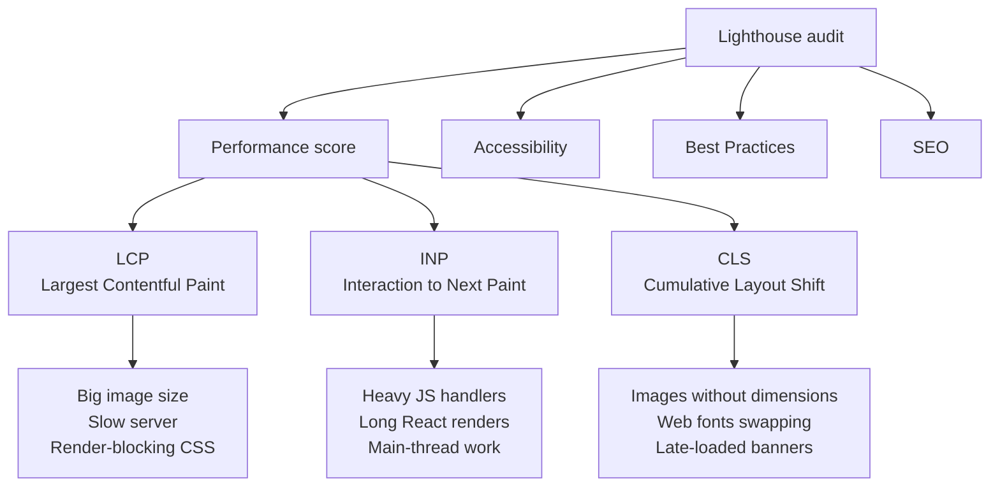

# Demo 9 — What are you actually shipping?

You've spent all day learning how a page loads, parses, styles, lays out, and paints. Lighthouse is the tool that measures every one of those steps and hands you a graded report card — and Google reads the same report to decide where you rank in search. Time to point it at a real site and see what falls out.

## Setup

No code to install. Everything happens inside Chrome.

1. Pick a target page. Good choices: **swiggy.com**, your college's website, a news site, or anything image-heavy you actually visit. Heavier is better — you want findings to read.
2. Open a **fresh Incognito window** (Cmd+Shift+N / Ctrl+Shift+N). This stops your extensions from polluting the score.
3. Navigate to the page, then press **Cmd+Opt+I** (Mac) or **Ctrl+Shift+I** (Windows/Linux) to open DevTools.
4. Click the **Lighthouse** tab at the top of DevTools. If you don't see it, click the **»** overflow menu.
5. Configure the run:
   - **Mode**: Navigation
   - **Device**: Mobile (Google ranks on mobile; this is the score that matters)
   - **Categories**: check all four — Performance, Accessibility, Best Practices, SEO
6. Click **Analyze page load**. It will reload the page, instrument it, and after ~15 seconds give you four big circular scores.

## Concepts

1. **Lighthouse runs the page in a controlled lab.** It throttles your network to mobile 4G, throttles CPU, reloads the page, and measures every step. It's not what *you* experience on fast Wi-Fi — it's what a real user on a mid-range Android phone experiences.

2. **Four dials, one that matters most.** Performance, Accessibility, Best Practices, SEO. They all matter, but Performance is the one you'll watch shift as you change code.

3. **Core Web Vitals — the three numbers Google ranks on.**
   - **LCP (Largest Contentful Paint)** — the time until the biggest visible element (usually the hero image or main headline) finishes rendering. The user's gut feel for *"the page loaded."* **Good: under 2.5s.**
   - **INP (Interaction to Next Paint)** — the delay between a tap/click and the screen visibly responding. A slow React re-render or heavy event handler destroys it. **Good: under 200ms.**
   - **CLS (Cumulative Layout Shift)** — how much stuff jumps around while the page is loading (classically, an image with no set height pushing text down once it arrives). **Good: under 0.1.**

4. **Opportunities & Diagnostics is the actual to-do list.** Scroll past the dials. Lighthouse names the specific files, image, or script slowing you down — biggest savings at the top. *"Properly size images"*, *"Eliminate render-blocking resources"*, *"Reduce unused JavaScript"* — each one is a real frontend concept with a number attached.

5. **Performance is a search-ranking signal.** Two sites with equally good content — the faster, more stable one ranks higher in Google. This isn't a vibe; it's the measurable number sitting in front of you in the report.

## Diagrams

<svg width="600" height="240" xmlns="http://www.w3.org/2000/svg">
  <rect x="0" y="0" width="600" height="240" fill="#f5f5f5"/>
  <text x="300" y="25" font-family="ui-sans-serif" font-size="13" font-weight="600" text-anchor="middle" fill="#171717">The LCP timeline — what a user actually sees</text>
  <line x1="40" y1="160" x2="560" y2="160" stroke="#a3a3a3" stroke-width="2"/>
  <line x1="40" y1="155" x2="40" y2="165" stroke="#a3a3a3" stroke-width="2"/>
  <line x1="560" y1="155" x2="560" y2="165" stroke="#a3a3a3" stroke-width="2"/>
  <text x="40" y="185" font-family="ui-sans-serif" font-size="11" text-anchor="middle" fill="#a3a3a3">0s</text>
  <text x="560" y="185" font-family="ui-sans-serif" font-size="11" text-anchor="middle" fill="#a3a3a3">4s</text>
  <line x1="120" y1="80" x2="120" y2="160" stroke="#a3a3a3" stroke-width="1" stroke-dasharray="3,3"/>
  <circle cx="120" cy="160" r="6" fill="#a3a3a3"/>
  <text x="120" y="70" font-family="ui-sans-serif" font-size="11" text-anchor="middle" fill="#171717">First paint</text>
  <text x="120" y="205" font-family="ui-sans-serif" font-size="11" text-anchor="middle" fill="#a3a3a3">0.6s</text>
  <text x="120" y="220" font-family="ui-sans-serif" font-size="10" text-anchor="middle" fill="#a3a3a3">header, nav</text>
  <line x1="240" y1="100" x2="240" y2="160" stroke="#a3a3a3" stroke-width="1" stroke-dasharray="3,3"/>
  <circle cx="240" cy="160" r="6" fill="#a3a3a3"/>
  <text x="240" y="90" font-family="ui-sans-serif" font-size="11" text-anchor="middle" fill="#171717">Text shows</text>
  <text x="240" y="205" font-family="ui-sans-serif" font-size="11" text-anchor="middle" fill="#a3a3a3">1.2s</text>
  <text x="240" y="220" font-family="ui-sans-serif" font-size="10" text-anchor="middle" fill="#a3a3a3">restaurant names</text>
  <line x1="400" y1="80" x2="400" y2="160" stroke="#fc8019" stroke-width="2" stroke-dasharray="3,3"/>
  <circle cx="400" cy="160" r="9" fill="#fc8019"/>
  <text x="400" y="70" font-family="ui-sans-serif" font-size="12" font-weight="600" text-anchor="middle" fill="#fc8019">LCP</text>
  <text x="400" y="205" font-family="ui-sans-serif" font-size="11" font-weight="600" text-anchor="middle" fill="#fc8019">2.4s</text>
  <text x="400" y="220" font-family="ui-sans-serif" font-size="10" text-anchor="middle" fill="#a3a3a3">hero biryani image</text>
  <line x1="510" y1="115" x2="510" y2="160" stroke="#a3a3a3" stroke-width="1" stroke-dasharray="3,3"/>
  <circle cx="510" cy="160" r="6" fill="#a3a3a3"/>
  <text x="510" y="105" font-family="ui-sans-serif" font-size="11" text-anchor="middle" fill="#171717">Done</text>
  <text x="510" y="205" font-family="ui-sans-serif" font-size="11" text-anchor="middle" fill="#a3a3a3">3.5s</text>
  <text x="510" y="220" font-family="ui-sans-serif" font-size="10" text-anchor="middle" fill="#a3a3a3">interactive</text>
</svg>

## Takeaways

- **LCP is "how fast did it show up", INP is "how fast does it react to me", CLS is "did it hold still while I was reading it."** Load, response, stability — the three things a user actually feels.
- A polished-looking page can still score 60 on Performance. **Pretty is not the same as fast.**
- **Opportunities** is sorted by impact — fixing the top item is almost always the biggest win.
- Most pages bleed performance from **images** (too large, wrong format) and **JavaScript** (too much, not split, not tree-shaken). Both are fixable.
- Run Lighthouse in **Incognito** — extensions like ad blockers and password managers wreck the score.
- In production you'd measure these **continuously**, on real users, every deploy. The single score is a snapshot; the **trend** is what catches regressions before users do.
