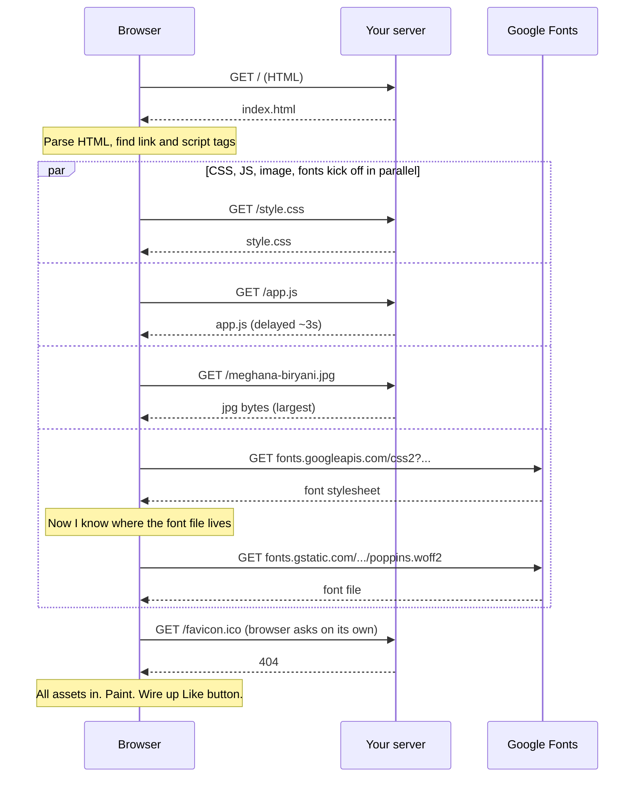

# Demo 1 — What just happened?

You typed one URL. You got back one card. Feels like one thing, right? It isn't. The Meghana Foods card on your left took the browser **six separate conversations** with two different servers, in a careful order, to put on your screen. This demo is about seeing those conversations — and noticing which ones blocked which.

## Setup

The card is already running in the iframe on the left. Here's how to watch the conversation happen:

1. Open DevTools. **Cmd-Opt-I** on Mac, **F12** on Windows/Linux.
2. Click into the iframe so DevTools targets it (not this page).
3. Go to the **Network** tab.
4. Hit reload **inside the iframe** — there's a small reload button at the top of the iframe, or right-click inside it and choose Reload. **Cmd-R reloads this whole page, not the iframe**, so resist the reflex.
5. Watch the waterfall fill in. Count the rows.

Now find the **throttling dropdown** at the top of the Network tab (it usually says "No throttling"). Switch it to **Slow 3G** and reload the iframe again. Same requests, much slower — now you can actually see the page assemble itself piece by piece.

Try one more thing: switch throttling back to "No throttling" and reload once more. Look at the **Size** column. Most rows now say `(disk cache)`. The browser remembered.

### Or run it locally

If you want to poke at the server too:

```bash
cd day_3/demo_1
uvicorn server:app --host 127.0.0.1 --port 8000 --reload
```

Open `http://localhost:8000/`. The terminal logs every request the browser makes — same set you see in DevTools.

## Concepts

**One URL is many requests.** The HTML you get back from `/` is just a recipe. It says "I need a stylesheet from `/style.css`, a script from `/app.js`, an image at `/meghana-biryani.jpg`, and a font from `fonts.googleapis.com`." The browser then goes and fetches each one. Six requests for this tiny card. Google's homepage triggers 50+. Every page on the internet works this way.

**The critical render path.** Before the browser can show pixels, it needs the **HTML** (parsed into a DOM tree) and the **CSS** (parsed into a CSSOM). CSS is **render-blocking** — the browser refuses to paint until it has the stylesheet, otherwise you'd see an ugly flash of unstyled content. JavaScript with `defer` doesn't block painting, but until it runs, anything interactive (like the Like button) is just decoration. **Pretty does not equal working.** Click Like before `app.js` lands and nothing happens.

**One request can cause another.** The Google Fonts stylesheet (request #5) isn't the font itself — it's a CSS file that *points to* the actual font file on a different server (request #6). The browser can't start #6 until #5 arrives and tells it where to look. That's why some bars in the waterfall start late: they were waiting on something earlier to even know they existed.

**Latency vs. throughput.** On a fast connection everything finishes so quickly the steps blur together. Slow 3G doesn't make your computer slower — it just adds round-trip delay between every request and response. Suddenly you can see that the image (big file, throughput-bound) and the JS (small file, latency-bound) struggle for different reasons.

**Browser cache.** When the server says `Cache-Control: max-age=3600`, the browser writes "I can reuse this for the next hour" next to the file on disk. The second reload skips the network entirely for those assets — that's the `(disk cache)` label and the 0ms time. Half the waterfall vanishes. The HTML still re-downloads because we mark it `no-cache` (so you always get the latest page), which is why it's only *half*.

## Diagrams

The order of conversations, browser to server:



A rough timing view — bars stacking left to right. HTML lands first, then CSS, JS, font CSS, and image kick off together. The font *file* has to wait for the font CSS. JS is artificially slowed so you can see the "card looks done but Like is dead" gap.

<svg width="600" height="240" xmlns="http://www.w3.org/2000/svg">
  <rect x="0" y="0" width="600" height="240" fill="#f5f5f5" />
  <text x="10" y="20" font-family="ui-sans-serif" font-size="13" font-weight="600" fill="#1c1c1c">Request waterfall (Slow 3G, rough)</text>

  <line x1="110" y1="35" x2="110" y2="220" stroke="#d4d4d4" stroke-width="1" />
  <line x1="240" y1="35" x2="240" y2="220" stroke="#d4d4d4" stroke-width="1" />
  <line x1="370" y1="35" x2="370" y2="220" stroke="#d4d4d4" stroke-width="1" />
  <line x1="500" y1="35" x2="500" y2="220" stroke="#d4d4d4" stroke-width="1" />
  <text x="110" y="232" font-family="ui-sans-serif" font-size="10" fill="#686b78" text-anchor="middle">0s</text>
  <text x="240" y="232" font-family="ui-sans-serif" font-size="10" fill="#686b78" text-anchor="middle">1s</text>
  <text x="370" y="232" font-family="ui-sans-serif" font-size="10" fill="#686b78" text-anchor="middle">2s</text>
  <text x="500" y="232" font-family="ui-sans-serif" font-size="10" fill="#686b78" text-anchor="middle">3s</text>

  <rect x="110" y="45" width="60" height="16" fill="#fc8019" stroke="#a3a3a3" />
  <text x="105" y="57" font-family="ui-sans-serif" font-size="12" fill="#1c1c1c" text-anchor="end">/ (HTML)</text>

  <rect x="170" y="68" width="50" height="16" fill="#fc8019" stroke="#a3a3a3" />
  <text x="165" y="80" font-family="ui-sans-serif" font-size="12" fill="#1c1c1c" text-anchor="end">/style.css</text>

  <rect x="170" y="91" width="320" height="16" fill="#fc8019" stroke="#a3a3a3" />
  <text x="165" y="103" font-family="ui-sans-serif" font-size="12" fill="#1c1c1c" text-anchor="end">/app.js (stalled)</text>

  <rect x="170" y="114" width="200" height="16" fill="#fc8019" stroke="#a3a3a3" />
  <text x="165" y="126" font-family="ui-sans-serif" font-size="12" fill="#1c1c1c" text-anchor="end">/meghana-biryani.jpg</text>

  <rect x="170" y="137" width="40" height="16" fill="#fc8019" stroke="#a3a3a3" />
  <text x="165" y="149" font-family="ui-sans-serif" font-size="12" fill="#1c1c1c" text-anchor="end">font CSS</text>

  <rect x="210" y="160" width="70" height="16" fill="#fc8019" stroke="#a3a3a3" />
  <text x="205" y="172" font-family="ui-sans-serif" font-size="12" fill="#1c1c1c" text-anchor="end">font file (waits)</text>

  <rect x="170" y="183" width="25" height="16" fill="#e5e5e5" stroke="#a3a3a3" />
  <text x="165" y="195" font-family="ui-sans-serif" font-size="12" fill="#1c1c1c" text-anchor="end">favicon (404)</text>
</svg>

Same waterfall on the **second** reload — most assets come from disk, no network round-trip:

<svg width="600" height="200" xmlns="http://www.w3.org/2000/svg">
  <rect x="0" y="0" width="600" height="200" fill="#f5f5f5" />
  <text x="10" y="20" font-family="ui-sans-serif" font-size="13" font-weight="600" fill="#1c1c1c">Second reload — cache kicks in</text>

  <rect x="170" y="45" width="40" height="16" fill="#fc8019" stroke="#a3a3a3" />
  <text x="165" y="57" font-family="ui-sans-serif" font-size="12" fill="#1c1c1c" text-anchor="end">/ (HTML, no-cache)</text>

  <rect x="170" y="68" width="6" height="16" fill="#e5e5e5" stroke="#a3a3a3" />
  <text x="165" y="80" font-family="ui-sans-serif" font-size="12" fill="#1c1c1c" text-anchor="end">/style.css (disk)</text>

  <rect x="170" y="91" width="6" height="16" fill="#e5e5e5" stroke="#a3a3a3" />
  <text x="165" y="103" font-family="ui-sans-serif" font-size="12" fill="#1c1c1c" text-anchor="end">/app.js (disk)</text>

  <rect x="170" y="114" width="6" height="16" fill="#e5e5e5" stroke="#a3a3a3" />
  <text x="165" y="126" font-family="ui-sans-serif" font-size="12" fill="#1c1c1c" text-anchor="end">image (disk)</text>

  <rect x="170" y="137" width="6" height="16" fill="#e5e5e5" stroke="#a3a3a3" />
  <text x="165" y="149" font-family="ui-sans-serif" font-size="12" fill="#1c1c1c" text-anchor="end">font (disk)</text>

  <text x="220" y="183" font-family="ui-sans-serif" font-size="11" fill="#686b78">Orange = network · Gray = disk cache · widths to scale</text>
</svg>

## Takeaways

- **One URL is a recipe, not a meal.** A single page is always a bundle of requests — count them before you optimise them.
- **CSS blocks paint. JS doesn't (with `defer`), but it does block interaction.** That's the gap where a card looks done but the Like button is dead.
- **Some requests wait on other requests.** A font file can't start downloading until the font CSS tells the browser it exists. Watch for staircase shapes in the waterfall.
- **Slow 3G is your X-ray.** When everything's fast, you can't see the order. Throttle to reveal what's blocking what.
- **The second reload is almost free** — but only because the server sent `Cache-Control`. Caching is something you opt into, header by header.
- **Disable cache** in DevTools makes you see what a first-time visitor sees. Your users aren't reloading like you are.
