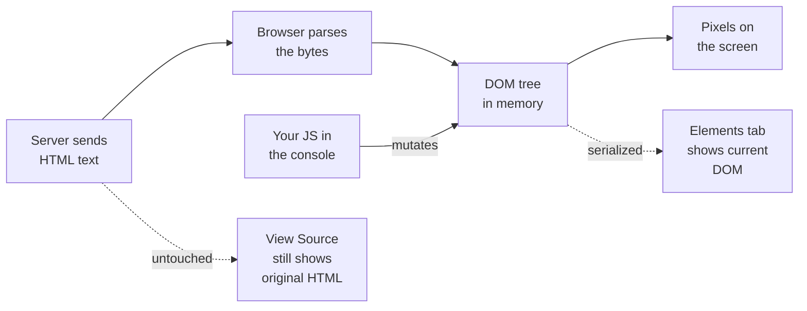

# Demo 2 — The DOM is not the HTML

You probably think "the HTML" and "what's on screen" are the same thing. They're not — and the gap between them is where most of frontend development lives. In this demo you'll prove it to yourself in sixty seconds by editing a real website in your own browser without touching the server.

## Setup

You'll run this one entirely in DevTools — there's no code to install.

1. Open **Demo 1** in a new tab — use the toolbar arrow (↗) on the Demo 1 page so the Swiggy card opens in its own tab.
2. Press **Cmd+Opt+I** (Mac) or **Ctrl+Shift+I** (Windows/Linux) to open Chrome DevTools.
3. Click the **Elements** tab. This is the live DOM tree.
4. Click the **Console** tab next to it. This is where you'll type JavaScript.
5. Right-click anywhere on the page (not in DevTools) and choose **View Page Source**. A new tab opens showing the raw HTML the server sent. Keep this tab around — you'll flip back to it.

Now you've got three views of the same page open: the rendered card, the live DOM in Elements, and the frozen HTML in View Source. The whole demo is noticing when those three stop agreeing.

## Concepts

1. **HTML is a string. The DOM is a tree.** When the server responds, it sends a chunk of text — that's HTML. The browser parses that text into an in-memory tree of objects called the **DOM** (Document Object Model). The screen is painted from the DOM, not from the HTML.

2. **JavaScript mutates the DOM, never the HTML.** Every `document.querySelector(...)`, every `element.textContent = ...`, every React render — all of it edits the live tree the browser is holding. The text the server sent stays frozen on the server.

3. **View Source vs Elements is the whole point.** *View Source* shows the original HTML response. *Elements* shows the current DOM serialized back into HTML-looking text. They match at page load and then drift apart the moment any script runs.

4. **Refresh resets the DOM, not the HTML.** Because your edits only live in the browser's memory, hitting refresh asks the server for the HTML again, builds a brand-new DOM, and everything snaps back. Nothing you did persisted anywhere.

5. **A web page is a data structure you can poke at.** This isn't hacking — it's local, it's yours, and it's how every browser extension, devtool, and bookmarklet you've ever used works.

## Try it

In the Console, run these one at a time and watch the page:

```js
document.querySelector('h1').textContent = 'HACKED'
```

```js
document.body.style.background = 'hotpink'
```

```js
document.body.innerHTML = '<h1>I deleted everything</h1>'
```

Each command rewrites the DOM, and the screen updates instantly. Now flip to the **View Source** tab and refresh it — the original HTML hasn't changed by a single character. Then hit **Cmd+R** on the page itself. The card is back, untouched. Your edits never left your machine.

Try the same thing on a real site — open `https://en.wikipedia.org` in a new tab and run:

```js
document.querySelector('h1').textContent = 'My Encyclopedia'
document.querySelector('header')?.remove()
```

If a selector doesn't match (real sites change their markup), right-click any element on the page and choose **Inspect** — DevTools selects it and binds it to the variable `$0` in the console. Then `$0.remove()` or `$0.textContent = 'whatever'` works on whatever you clicked.

## Diagrams



<svg width="600" height="240" xmlns="http://www.w3.org/2000/svg">
  <rect x="0" y="0" width="600" height="240" fill="#f5f5f5"/>
  <rect x="20" y="30" width="240" height="180" fill="#ffffff" stroke="#a3a3a3" stroke-width="1"/>
  <text x="140" y="55" font-family="ui-sans-serif" font-size="13" font-weight="600" text-anchor="middle" fill="#171717">What the server sent</text>
  <text x="140" y="75" font-family="ui-sans-serif" font-size="11" text-anchor="middle" fill="#a3a3a3">(View Source)</text>
  <text x="35" y="105" font-family="ui-monospace, monospace" font-size="11" fill="#171717">&lt;h1&gt;Meghana Foods&lt;/h1&gt;</text>
  <text x="35" y="125" font-family="ui-monospace, monospace" font-size="11" fill="#171717">&lt;span id="like-count"&gt;</text>
  <text x="35" y="140" font-family="ui-monospace, monospace" font-size="11" fill="#171717">  0</text>
  <text x="35" y="155" font-family="ui-monospace, monospace" font-size="11" fill="#171717">&lt;/span&gt;</text>
  <text x="140" y="190" font-family="ui-sans-serif" font-size="11" text-anchor="middle" fill="#a3a3a3">frozen text</text>
  <path d="M 270 120 L 330 120" stroke="#fc8019" stroke-width="2" marker-end="url(#arrow)"/>
  <text x="300" y="110" font-family="ui-sans-serif" font-size="11" text-anchor="middle" fill="#fc8019">parse + JS</text>
  <rect x="340" y="30" width="240" height="180" fill="#ffffff" stroke="#fc8019" stroke-width="2"/>
  <text x="460" y="55" font-family="ui-sans-serif" font-size="13" font-weight="600" text-anchor="middle" fill="#171717">What the browser shows</text>
  <text x="460" y="75" font-family="ui-sans-serif" font-size="11" text-anchor="middle" fill="#a3a3a3">(Elements tab / the DOM)</text>
  <circle cx="380" cy="105" r="5" fill="#fc8019"/>
  <text x="395" y="109" font-family="ui-monospace, monospace" font-size="11" fill="#171717">h1: "HACKED"</text>
  <circle cx="380" cy="130" r="5" fill="#fc8019"/>
  <text x="395" y="134" font-family="ui-monospace, monospace" font-size="11" fill="#171717">span#like-count: 3</text>
  <circle cx="380" cy="155" r="5" fill="#fc8019"/>
  <text x="395" y="159" font-family="ui-monospace, monospace" font-size="11" fill="#171717">body.style: hotpink</text>
  <text x="460" y="190" font-family="ui-sans-serif" font-size="11" text-anchor="middle" fill="#fc8019">live tree</text>
  <defs>
    <marker id="arrow" markerWidth="10" markerHeight="10" refX="9" refY="3" orient="auto">
      <path d="M0,0 L0,6 L9,3 z" fill="#fc8019"/>
    </marker>
  </defs>
</svg>

## Takeaways

- **HTML** is the static text response from the server. **DOM** is the live object tree in your browser's memory.
- Every framework you'll ever use — React, Vue, Svelte — is just a fancier way to mutate the DOM.
- **View Source** never changes after page load. **Elements** changes every time anything runs.
- **Refresh** fetches the HTML again and rebuilds a fresh DOM. That's why your hacks vanish.
- DevTools is your superpower: right-click → Inspect on anything, anywhere, and you can read or change it.
- This is local-only. You can't break someone else's site this way — you're only editing what your browser is holding.
