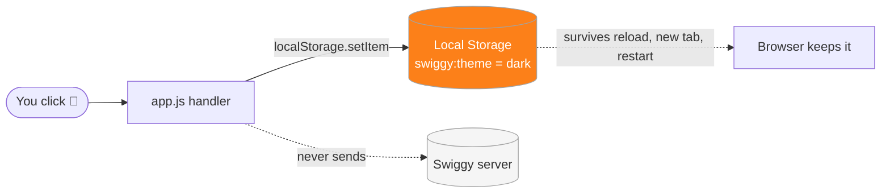
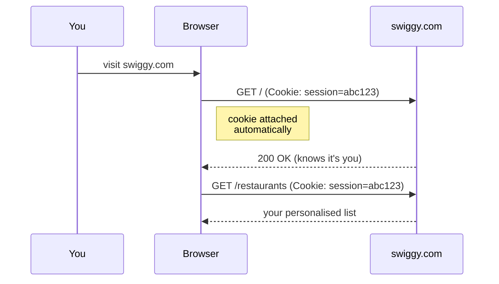

# Demo 2.5 — Your browser is holding your data

Every site you use is quietly stashing things on your machine. Your Swiggy dark-mode preference, your half-finished checkout, the cookie that proves you're logged in — they all live in different drawers inside your browser, and each drawer has very different rules about who can see it and how long it sticks around. Open this demo, poke at the controls, and watch those drawers fill up in real time.

## Setup

Open **DevTools → Application**. Three panels are about to do all the talking:

- **Cookies**
- **Local Storage**
- **Session Storage**

In the iframe on the left, flip the **🌙 Dark mode** toggle. Watch `swiggy:theme` appear under Local Storage. Click **Next →** a couple of times in the Checkout card. Watch `swiggy:checkoutStep` appear under Session Storage.

Now try a few experiments:

- **Reload the iframe.** Both values survive. The page reads them on load.
- **Open the demo URL in a new tab** (right-click the iframe → Open in new tab). Dark mode is still on (localStorage is shared across tabs). The checkout step resets to 1 (sessionStorage is per-tab).
- **Close that new tab and reopen it.** Dark mode is *still* on. localStorage survives browser restarts.
- For cookies, hop over to a real site you're logged into — `swiggy.com`, YouTube, GitHub — and look at the Cookies panel for that domain. Those values get attached to every request the browser makes to that domain. You never wrote code to send them.

**Or run it locally:**

```bash
cd day_3/demo_2_5
uvicorn server:app --host 127.0.0.1 --port 8000 --reload
```

Then open `http://localhost:8000/`.

## Concepts

**Three storage layers, three lifetimes.** Cookies live until they expire (or you wipe them). localStorage lives forever, across tabs and restarts. sessionStorage lives until the tab closes. Same browser, three completely different contracts.

**Cookies ride along on every HTTP request.** When your browser asks `swiggy.com` for anything — a page, an image, an API call — it automatically tacks every cookie for that domain onto the request headers. That's how the server knows it's still you. It's also why cookies are tiny (~4KB cap): you're paying that cost on every single request.

**localStorage and sessionStorage never touch the wire.** They're JavaScript-only stores. Nothing in them ever leaves the browser unless your code explicitly puts it in a `fetch()`. That's why you keep auth tokens out of them (the server can't see them anyway) and why they can be much bigger (~5–10MB).

**Everything is per-origin.** `swiggy.com` cannot read `zomato.com`'s storage. The browser keys every drawer by origin (`scheme://host:port`). This is the foundation of web security — without it, any tab could read any other site's session.

**Pick the right drawer for the job.** Auth → cookie (server needs it). UI preferences → localStorage (persists; only the browser cares). In-flight form/checkout state → sessionStorage (don't lose progress on refresh, don't leak it to other tabs).

## Diagrams

**The flow when you flip a toggle:**



Compare that with what a cookie does on a normal page load:



**Three drawers, side by side:**

<svg width="600" height="240" xmlns="http://www.w3.org/2000/svg" font-family="ui-sans-serif" font-size="12">
  <rect width="600" height="240" fill="#ffffff"/>

  <!-- Cookie box -->
  <rect x="20" y="40" width="170" height="140" rx="10" fill="#f5f5f5" stroke="#a3a3a3"/>
  <text x="105" y="62" text-anchor="middle" font-weight="700" fill="#1a1a1a">Cookies</text>
  <text x="105" y="82" text-anchor="middle" fill="#6b6b6b">~4KB</text>
  <text x="105" y="100" text-anchor="middle" fill="#1a1a1a">session=abc123</text>
  <text x="105" y="118" text-anchor="middle" fill="#1a1a1a">lang=en-IN</text>
  <text x="105" y="150" text-anchor="middle" fill="#6b6b6b">expires when</text>
  <text x="105" y="166" text-anchor="middle" fill="#6b6b6b">told to</text>
  <!-- arrow to server -->
  <line x1="190" y1="110" x2="240" y2="110" stroke="#fc8019" stroke-width="2"/>
  <polygon points="240,110 232,106 232,114" fill="#fc8019"/>
  <text x="215" y="102" text-anchor="middle" fill="#fc8019" font-weight="700">to server</text>

  <!-- Server pill -->
  <rect x="245" y="92" width="60" height="36" rx="18" fill="#fc8019" stroke="#fc8019"/>
  <text x="275" y="115" text-anchor="middle" fill="#ffffff" font-weight="700">server</text>

  <!-- localStorage box -->
  <rect x="320" y="40" width="120" height="140" rx="10" fill="#f5f5f5" stroke="#a3a3a3"/>
  <text x="380" y="62" text-anchor="middle" font-weight="700" fill="#1a1a1a">localStorage</text>
  <text x="380" y="82" text-anchor="middle" fill="#6b6b6b">~5–10MB</text>
  <text x="380" y="104" text-anchor="middle" fill="#1a1a1a">swiggy:theme</text>
  <text x="380" y="120" text-anchor="middle" fill="#1a1a1a">= "dark"</text>
  <text x="380" y="148" text-anchor="middle" fill="#6b6b6b">forever</text>
  <text x="380" y="164" text-anchor="middle" fill="#6b6b6b">🔒 sealed</text>

  <!-- sessionStorage box -->
  <rect x="460" y="40" width="120" height="140" rx="10" fill="#f5f5f5" stroke="#a3a3a3"/>
  <text x="520" y="62" text-anchor="middle" font-weight="700" fill="#1a1a1a">sessionStorage</text>
  <text x="520" y="82" text-anchor="middle" fill="#6b6b6b">~5MB</text>
  <text x="520" y="104" text-anchor="middle" fill="#1a1a1a">swiggy:</text>
  <text x="520" y="120" text-anchor="middle" fill="#1a1a1a">checkoutStep = 2</text>
  <text x="520" y="148" text-anchor="middle" fill="#6b6b6b">dies with tab</text>
  <text x="520" y="164" text-anchor="middle" fill="#6b6b6b">🔒 sealed</text>

  <!-- caption -->
  <text x="300" y="220" text-anchor="middle" fill="#6b6b6b">Only the cookie box has an arrow leaving the browser.</text>
</svg>

## Takeaways

- **Auth tokens belong in cookies** (ideally `HttpOnly; Secure; SameSite`), because the server needs them on every request and JavaScript shouldn't be able to steal them.
- **UI preferences belong in localStorage** — dark mode, language, "don't show this banner again." Persistent, no server round-trip, cheap to read.
- **In-flight state belongs in sessionStorage** — a multi-step checkout, an unsaved draft, a wizard. Refresh is safe; leaking into other tabs is not.
- **Never trust storage as a source of truth for anything sensitive.** A user can edit any of these from the Console. The server must re-check anything that matters.
- **Watch the size.** Cookies are sent on every request — keep them tiny. If you find yourself stuffing JSON into a cookie, you wanted localStorage.
- **Storage is per-origin.** Different subdomain, different port, different scheme = different drawer. Plan your origins before you plan your storage keys.
