# Demo 3 — Why order matters

Where you put a `<script>` tag changes whether your page is blank for two seconds. Same Swiggy restaurant card, same `slow.js`, three placements — and three very different experiences. By the end of this demo you'll know exactly why a single line of HTML can decide whether your page feels fast or broken.

## Setup

Use the tab picker above the iframe to switch between **Index**, **A: blocking in `<head>`**, **B: `defer` in `<head>`**, and **C: end of `<body>`**. Open DevTools, go to the **Network** tab, and set throttling to **Slow 3G**. Then click reload inside the iframe and watch the Meghana Foods card — specifically, watch *when* it appears.

For the clearest signal, also open the **Console**: `slow.js` logs when it starts and finishes. If the iframe feels cramped, hit the ↗ button on the toolbar to pop the current version into its own tab.

Try the versions in this order: A first (the painful one), then C, then B. You'll feel the difference more than you'll read it.

## Concepts

- **HTML is parsed top-to-bottom.** The browser walks your document tag by tag, building the DOM as it goes. Anything that interrupts that walk delays everything below it.
- **A plain `<script>` is render-blocking.** When the parser hits one, it stops — fully stops — to download and execute the script before reading another byte of HTML. Why? Because old scripts could call `document.write` and rewrite the page mid-parse, so the browser plays it safe.
- **`defer` and `async` are the modern fix.** Both tell the browser "keep parsing, I'll wait." `defer` runs the script after parsing finishes, in order. `async` runs it the moment it lands, order be damned. For most app code you want `defer`.
- **Placement still matters.** Even without blocking, a `<script>` at the end of `<body>` only *starts* downloading once the parser gets there. `defer` in `<head>` starts the download immediately and in parallel — which is why B usually wins.
- **Once a script runs, it owns the main thread.** Network tricks like `defer` only solve the *download* problem. A 2-second CPU loop (like `slow.js`) still freezes the page while it runs. Placement is necessary, not sufficient.

## Diagrams

Three timelines side by side. Notice when "render" happens in each row.

```mermaid
gantt
    title Same page, three script placements (Slow 3G)
    dateFormat  X
    axisFormat  %Ls

    section A — blocking in <head>
    Parse HTML (head)        :a1, 0, 200
    Fetch slow.js            :crit, a2, after a1, 1500ms
    Run slow.js (2s CPU)     :crit, a3, after a2, 2000ms
    Parse body + Render      :a4, after a3, 300ms

    section B — defer in <head>
    Parse HTML               :b1, 0, 600
    Fetch slow.js (parallel) :b2, 0, 1500
    Render page              :active, b3, after b1, 100ms
    Run slow.js              :b4, after b2, 2000ms

    section C — end of <body>
    Parse HTML               :c1, 0, 800
    Render page              :active, c2, after c1, 100ms
    Fetch slow.js            :c3, after c1, 1500ms
    Run slow.js (freezes UI) :crit, c4, after c3, 2000ms
```



And the same story as a single timeline — orange marks the moment you can finally see the restaurant card.

```html
<svg width="600" height="240" xmlns="http://www.w3.org/2000/svg" font-family="ui-sans-serif" font-size="12">
  <rect x="0" y="0" width="600" height="240" fill="#f5f5f5"/>

  <!-- Time axis -->
  <line x1="40" y1="215" x2="580" y2="215" stroke="#a3a3a3" stroke-width="1"/>
  <text x="40" y="232" fill="#666">0s</text>
  <text x="175" y="232" fill="#666">1s</text>
  <text x="310" y="232" fill="#666">2s</text>
  <text x="445" y="232" fill="#666">3s</text>
  <text x="555" y="232" fill="#666">4s</text>

  <!-- Row A: blocking in head -->
  <text x="5" y="45" fill="#1c1c1c" font-weight="600">A</text>
  <rect x="40" y="30" width="20" height="20" fill="#a3a3a3"/>
  <rect x="60" y="30" width="200" height="20" fill="#a3a3a3" opacity="0.7"/>
  <rect x="260" y="30" width="270" height="20" fill="#1c1c1c"/>
  <rect x="530" y="30" width="50" height="20" fill="#fc8019"/>
  <text x="65" y="20" fill="#666" font-size="10">fetch slow.js (blocked)</text>
  <text x="265" y="20" fill="#666" font-size="10">run slow.js (main thread frozen)</text>
  <text x="535" y="65" fill="#fc8019" font-weight="600" font-size="10">page visible (~3.5s)</text>

  <!-- Row B: defer in head -->
  <text x="5" y="115" fill="#1c1c1c" font-weight="600">B</text>
  <rect x="40" y="100" width="80" height="20" fill="#a3a3a3" opacity="0.5"/>
  <rect x="120" y="100" width="20" height="20" fill="#fc8019"/>
  <rect x="40" y="125" width="200" height="8" fill="#a3a3a3" opacity="0.7"/>
  <rect x="240" y="100" width="270" height="20" fill="#1c1c1c"/>
  <text x="45" y="92" fill="#666" font-size="10">parse HTML</text>
  <text x="40" y="148" fill="#666" font-size="9">slow.js fetching in parallel</text>
  <text x="245" y="92" fill="#666" font-size="10">run slow.js (after render)</text>
  <text x="125" y="160" fill="#fc8019" font-weight="600" font-size="10">page visible (~0.6s)</text>

  <!-- Row C: end of body -->
  <text x="5" y="195" fill="#1c1c1c" font-weight="600">C</text>
  <rect x="40" y="180" width="110" height="20" fill="#a3a3a3" opacity="0.5"/>
  <rect x="150" y="180" width="20" height="20" fill="#fc8019"/>
  <rect x="170" y="180" width="135" height="20" fill="#a3a3a3" opacity="0.7"/>
  <rect x="305" y="180" width="270" height="20" fill="#1c1c1c"/>
  <text x="45" y="172" fill="#666" font-size="10">parse, then fetch starts</text>
  <text x="310" y="172" fill="#666" font-size="10">run slow.js (page freezes)</text>
  <text x="155" y="210" fill="#fc8019" font-weight="600" font-size="10">page visible (~0.8s)</text>
</svg>
```

## Takeaways

- **Default to `defer` on every external script in `<head>`.** It's the closest thing to a free lunch in frontend performance.
- **Use `async` only for genuinely independent scripts** — analytics, error reporters, ad pixels. Order is not guaranteed.
- **"Render-blocking" is about the main thread, not just the network.** `defer` saves the download; it can't save you from a 2-second CPU loop.
- **End-of-`<body>` placement is the old fix.** It works, but it delays the *download* of the script. Prefer `defer` in `<head>`.
- **Inline CSS or critical CSS in `<head>`** so the first paint doesn't wait on a stylesheet round-trip. CSS is render-blocking too — for a different reason.
- **Test on Slow 3G, not your fast laptop.** The difference between A and B is invisible on a fast network. Your users are on the slow one.
