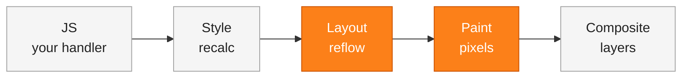

# Demo 4 — The expensive DOM

Five hundred Swiggy restaurant tiles. Two buttons that resize every tile to the exact same look. The visual result is identical — the timing badge is not. One path is sometimes 50–100x slower than the other, and the only difference is *how* you ask the browser to do the work. That gap is where most "why is my page janky" stories live, and it's the same problem React was built to hide from you.

## Setup

The iframe on the left is the whole demo.

1. Click **Resize each (slow)**. Read the ms in the timing badge.
2. Click **Reset**.
3. Click **Resize all (batched / fast)**. Read the ms again.
4. Compare. The ratio is the lesson — your exact numbers will vary by machine.

**For the brave** — open DevTools → **Performance** tab → record a ~3 second profile around each click. You'll see the slow click smear the timeline with hundreds of tiny purple **Layout** bars and green **Paint** bars. The fast click shows one of each. Bonus: DevTools → `Cmd+Shift+P` → "Show Rendering" → enable **Paint flashing** to literally see green flashes wherever the browser repaints.

**Or run it locally:**

```bash
cd day_3/demo_4
python3 -m venv .venv && source .venv/bin/activate
pip install -r requirements.txt
uvicorn server:app --host 127.0.0.1 --port 8000 --reload
```

## Concepts

**The rendering pipeline.** When pixels change on screen, the browser runs a sequence: your **JS** runs, then **Style** is recomputed, then **Layout** figures out where every box sits, then **Paint** fills in pixels, then **Composite** stitches the layers together. Cheap edits (a color change) skip layout. Anything that affects size or position has to redo layout *and* paint.

**Reading layout is not free.** Properties like `offsetWidth`, `offsetHeight`, `getBoundingClientRect()`, and `clientTop` look innocent, but they force the browser to give you an *honest, up-to-date* answer. If you have unflushed style writes pending, the browser must run layout *right now* to answer you. That's called a **forced synchronous layout** or **reflow**.

**Layout thrashing.** Write a style, read a layout property, write, read, write, read — in a loop. Each read forces a reflow because each write invalidated layout. 500 tiles → 500 full-grid reflows. The slow button does exactly this (peek at `app.js` — the `tile.offsetWidth;` line on its own is the culprit).

**The fix is batching.** Do all your reads first, then all your writes (or, better, change one class on the parent and let CSS do it). The browser is *already* trying to batch DOM mutations for you; your job is to stop interrupting it.

**This is why React exists.** React's render phase computes the next UI in memory, then the commit phase applies the changes in one well-ordered pass. You never accidentally interleave reads and writes, because you're not touching the DOM directly. Demo 6 will make that concrete.

## Diagrams

The rendering pipeline — and which stages each path triggers per click:



Slow click = this pipeline runs **~500 times** in one handler. Fast click = it runs **once**.

Layout thrashing vs batched writes (each tick is one DOM operation, time flows left to right):

<svg width="600" height="220" viewBox="0 0 600 220" xmlns="http://www.w3.org/2000/svg" font-family="ui-sans-serif" font-size="12">
  <text x="0" y="16" font-weight="700" fill="#222">Slow: read, write, read, write, read, write…</text>
  <text x="0" y="34" fill="#a3a3a3">Each write invalidates layout. Each read forces a reflow. 500 reflows.</text>
  <line x1="0" y1="68" x2="600" y2="68" stroke="#a3a3a3" stroke-width="1"/>
  <g>
    <rect x="5"   y="48" width="14" height="20" fill="#a3a3a3"/>
    <rect x="22"  y="48" width="14" height="20" fill="#fc8019"/>
    <rect x="39"  y="48" width="14" height="20" fill="#a3a3a3"/>
    <rect x="56"  y="48" width="14" height="20" fill="#fc8019"/>
    <rect x="73"  y="48" width="14" height="20" fill="#a3a3a3"/>
    <rect x="90"  y="48" width="14" height="20" fill="#fc8019"/>
    <rect x="107" y="48" width="14" height="20" fill="#a3a3a3"/>
    <rect x="124" y="48" width="14" height="20" fill="#fc8019"/>
    <rect x="141" y="48" width="14" height="20" fill="#a3a3a3"/>
    <rect x="158" y="48" width="14" height="20" fill="#fc8019"/>
    <rect x="175" y="48" width="14" height="20" fill="#a3a3a3"/>
    <rect x="192" y="48" width="14" height="20" fill="#fc8019"/>
    <rect x="209" y="48" width="14" height="20" fill="#a3a3a3"/>
    <rect x="226" y="48" width="14" height="20" fill="#fc8019"/>
    <rect x="243" y="48" width="14" height="20" fill="#a3a3a3"/>
    <rect x="260" y="48" width="14" height="20" fill="#fc8019"/>
    <rect x="277" y="48" width="14" height="20" fill="#a3a3a3"/>
    <rect x="294" y="48" width="14" height="20" fill="#fc8019"/>
    <rect x="311" y="48" width="14" height="20" fill="#a3a3a3"/>
    <rect x="328" y="48" width="14" height="20" fill="#fc8019"/>
    <rect x="345" y="48" width="14" height="20" fill="#a3a3a3"/>
    <rect x="362" y="48" width="14" height="20" fill="#fc8019"/>
    <rect x="379" y="48" width="14" height="20" fill="#a3a3a3"/>
    <rect x="396" y="48" width="14" height="20" fill="#fc8019"/>
    <rect x="413" y="48" width="14" height="20" fill="#a3a3a3"/>
    <rect x="430" y="48" width="14" height="20" fill="#fc8019"/>
    <rect x="447" y="48" width="14" height="20" fill="#a3a3a3"/>
    <rect x="464" y="48" width="14" height="20" fill="#fc8019"/>
    <rect x="481" y="48" width="14" height="20" fill="#a3a3a3"/>
    <rect x="498" y="48" width="14" height="20" fill="#fc8019"/>
    <rect x="515" y="48" width="14" height="20" fill="#a3a3a3"/>
    <rect x="532" y="48" width="14" height="20" fill="#fc8019"/>
    <rect x="549" y="48" width="14" height="20" fill="#a3a3a3"/>
    <rect x="566" y="48" width="14" height="20" fill="#fc8019"/>
    <rect x="583" y="48" width="14" height="20" fill="#a3a3a3"/>
  </g>

  <text x="0" y="116" font-weight="700" fill="#222">Fast: read, read, read │ write, write, write</text>
  <text x="0" y="134" fill="#a3a3a3">All reads first, then all writes. One reflow at the end.</text>
  <line x1="0" y1="168" x2="600" y2="168" stroke="#a3a3a3" stroke-width="1"/>
  <g>
    <rect x="5"   y="148" width="14" height="20" fill="#a3a3a3"/>
    <rect x="22"  y="148" width="14" height="20" fill="#a3a3a3"/>
    <rect x="39"  y="148" width="14" height="20" fill="#a3a3a3"/>
    <rect x="56"  y="148" width="14" height="20" fill="#a3a3a3"/>
    <rect x="73"  y="148" width="14" height="20" fill="#a3a3a3"/>
    <rect x="90"  y="148" width="14" height="20" fill="#a3a3a3"/>
    <rect x="107" y="148" width="14" height="20" fill="#a3a3a3"/>
    <rect x="124" y="148" width="14" height="20" fill="#a3a3a3"/>
    <rect x="141" y="148" width="14" height="20" fill="#a3a3a3"/>
  </g>
  <line x1="290" y1="142" x2="290" y2="174" stroke="#222" stroke-width="1" stroke-dasharray="3,3"/>
  <text x="294" y="144" fill="#222">flush</text>
  <g>
    <rect x="310" y="148" width="14" height="20" fill="#fc8019"/>
    <rect x="327" y="148" width="14" height="20" fill="#fc8019"/>
    <rect x="344" y="148" width="14" height="20" fill="#fc8019"/>
    <rect x="361" y="148" width="14" height="20" fill="#fc8019"/>
    <rect x="378" y="148" width="14" height="20" fill="#fc8019"/>
    <rect x="395" y="148" width="14" height="20" fill="#fc8019"/>
    <rect x="412" y="148" width="14" height="20" fill="#fc8019"/>
    <rect x="429" y="148" width="14" height="20" fill="#fc8019"/>
    <rect x="446" y="148" width="14" height="20" fill="#fc8019"/>
  </g>

  <g transform="translate(0,196)">
    <rect x="0" y="0" width="14" height="14" fill="#a3a3a3"/>
    <text x="20" y="11" fill="#222">read (offsetWidth, getBoundingClientRect, …)</text>
    <rect x="300" y="0" width="14" height="14" fill="#fc8019"/>
    <text x="320" y="11" fill="#222">write (style change)</text>
  </g>
</svg>

## Takeaways

- **Treat `offsetHeight`, `offsetWidth`, and `getBoundingClientRect()` as expensive.** They look like reads. They're really "flush any pending layout and reply."
- **Batch your reads, then your writes.** Inside one handler, never interleave the two — that's the whole game.
- **One class toggle on a parent beats 500 inline style writes.** Let CSS fan out the change in a single pass.
- **The Performance tab is your X-ray.** Long stripes of purple Layout bars in one handler = layout thrash, every time.
- **This is exactly what React's render phase does for you.** It computes the new tree, then commits in one ordered pass. You stop thrashing without thinking about it.
- **The ratio matters, not the absolute number.** A slow click might be 30 ms on a fast laptop and 500 ms on a cheap phone. The fast click stays small on both. That's the cliff your users actually feel.
