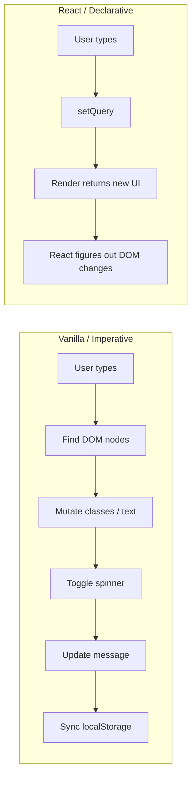

# Demo 5 — This is why React exists

You've probably heard "React makes UIs easier" and quietly wondered, _easier than what?_ This demo answers that question with a real, growing feature: a Swiggy restaurant search. You'll build it once in vanilla JavaScript, watch a PM bolt on four small extras, see the code turn into a tangle, and then rebuild the exact same thing in React. By the end the difference won't be a slogan — it'll be something you _felt_.

## Setup

On the left of this page there's an iframe with three tabs:

- **Vanilla simple** — the clean starting point. Around 25 lines.
- **Vanilla full** — the same page after the PM piles on four features.
- **React** — the same four features, declarative, in React.

React, ReactDOM and Babel are vendored locally inside the demo folder, so nothing reaches out to the internet — open the tabs and they just work.

**Thing to try first:** open _Vanilla simple_, type "pizza", watch the list filter. Then switch to _Vanilla full_ and try the same thing. Same UX from the user's perspective, right? Now flip both source files open side by side. That gap — same behaviour, wildly different code — is the whole point.

## Concepts

### Imperative vs declarative

Imperative code is a list of _steps_: find this node, change that class, append these children, hide this div. You're the one driving the DOM. Declarative code is a _description_: "here's what the screen should look like right now." Something else figures out the steps. Vanilla JS pushes you toward imperative. React pushes you toward declarative.

### State is the source of truth

In the React version, the whole UI boils down to three variables: `query`, `loading`, `results`. If you can describe the screen as a pure function of those three, you've already won — every render is just "what does the page look like for _these_ values?" In the vanilla version there is no single source of truth; the truth is scattered across the DOM, a debounce timer, `localStorage`, and a few `classList` toggles.

### How vanilla rots as features grow

The simple vanilla page is genuinely fine. The trouble starts when features _interact_. The spinner has to know about the message. The message has to know about the highlight. The highlight has to know about HTML-escaping. The `localStorage` restore has to know to re-run the search. Each new feature multiplies the number of pairs that have to stay in sync, and you're tracking every pair in your head.

### Render as a function of state

React flips the model. You don't say "hide the spinner when results arrive." You say "render the spinner when `loading` is true." When `loading` flips to false, the spinner is just _not in the description anymore_, and React removes it. You stop writing transitions; you write _snapshots_, and React handles getting from one snapshot to the next.

### React isn't always less code

Count the lines — they're in the same ballpark. The win isn't fewer characters. It's that the vanilla version's complexity grew _exponentially_ with features (every pair of features had to be reconciled by hand), while the React version grew _linearly_ (one new state + one new line of description per feature). That trade is the reason a whole industry moved.

## Diagrams

### How an update happens

### Code growth as features pile on

<svg width="600" height="220" xmlns="http://www.w3.org/2000/svg" style="font-family: ui-sans-serif; font-size: 12px;">
  <rect width="600" height="220" fill="#f5f5f5"/>
  <text x="20" y="24" fill="#404040" font-weight="600">Lines of code as features grow (1 → 5)</text>

  <line x1="40" y1="190" x2="580" y2="190" stroke="#a3a3a3"/>
  <line x1="40" y1="50" x2="40" y2="190" stroke="#a3a3a3"/>

  <!-- Vanilla curve: explodes -->
  <polyline points="60,180 160,170 260,150 360,110 460,70 560,55"
    fill="none" stroke="#fc8019" stroke-width="3"/>
  <text x="470" y="50" fill="#fc8019" font-weight="600">Vanilla</text>

  <!-- React curve: linear-ish -->
  <polyline points="60,170 160,160 260,150 360,140 460,130 560,120"
    fill="none" stroke="#404040" stroke-width="3" stroke-dasharray="6 4"/>
  <text x="470" y="115" fill="#404040" font-weight="600">React</text>

  <text x="40" y="210" fill="#a3a3a3">1 feature</text>
  <text x="510" y="210" fill="#a3a3a3">5 features</text>
</svg>

### Places that touch the DOM

<svg width="600" height="140" xmlns="font-family: ui-sans-serif;" style="font-family: ui-sans-serif; font-size: 12px;">
  <rect width="600" height="140" fill="#f5f5f5"/>
  <text x="20" y="24" fill="#404040" font-weight="600">Spots in your code that mutate the DOM directly</text>

  <text x="20" y="60" fill="#404040">Vanilla simple</text>
  <rect x="180" y="48" width="40" height="16" fill="#fc8019"/>
  <text x="230" y="60" fill="#a3a3a3">~2</text>

  <text x="20" y="90" fill="#404040">Vanilla full</text>
  <rect x="180" y="78" width="320" height="16" fill="#fc8019"/>
  <text x="510" y="90" fill="#a3a3a3">~16</text>

  <text x="20" y="120" fill="#404040">React</text>
  <rect x="180" y="108" width="20" height="16" fill="#fc8019"/>
  <text x="210" y="120" fill="#a3a3a3">1 (ReactDOM.render)</text>
</svg>

## Takeaways

- **Imperative code lists DOM steps; declarative code describes the UI.** You'll feel this every time you remember to hide something — or forget.
- **State is the source of truth.** If you can't name the variables that drive your UI, you're going to spend your week chasing bugs where the screen disagrees with itself.
- **Complexity, not character count, is the real cost.** Vanilla doesn't lose on line count; it loses because every new feature has to coordinate with every old one.
- **React doesn't make _small_ things faster — it makes _growing_ things survivable.** The 25-line vanilla page is fine. The 150-line one is where you'd want React.
- **Read the React file like a description, not a script.** "When `loading`, render `<Spinner/>`." Not "show the spinner now and hide it later."
- **One change in mindset unlocks the rest of the week:** stop thinking in DOM mutations, start thinking in state.
