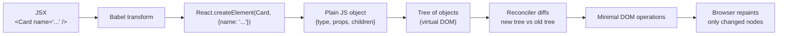

# Demo 6 — What React actually does

Demo 5 convinced you _why_ React exists. This one opens the hood. You'll see that JSX isn't a new language, the virtual DOM isn't a magic trick, and "React is fast" comes down to one boring, beautiful idea: keep a cheap copy of the UI in memory, diff it against the new one, and only touch the real DOM where it actually needs to change.

## Setup

On the left is a single live playground: `jsx-vs-compiled.html`. It uses Babel-standalone to compile JSX in the browser, so you can read three things side by side:

1. The **JSX** you write (looks like HTML).
2. The **compiled** `React.createElement(...)` calls Babel turns it into.
3. The **plain JavaScript object** that `createElement` returns — a node of the virtual DOM.

React, ReactDOM and Babel are vendored locally, so nothing hits the network.

**Thing to try:** open your browser's DevTools console while the playground is loaded. You'll see a logged React element. Expand it. It's not a "React thing" — it's a plain object with a `type`, `props`, and `children`. Once you accept that, everything else clicks.

## Concepts

### JSX is just sugar

`<Card name="Meghana Foods" />` looks like markup, but the browser never sees those angle brackets. Babel (or in a real project, your bundler) rewrites every JSX tag into a function call: `React.createElement(Card, { name: "Meghana Foods" })`. That's it. JSX is a thin syntax over a function call you could have written by hand — and the playground shows the hand-written version next to the JSX version so you can compare them line for line.

### The virtual DOM is _just objects_

`React.createElement` doesn't touch the DOM. It returns a JavaScript object that roughly looks like `{ type: "div", props: { className: "card", children: [...] } }`. A whole tree of those objects is what people call the "virtual DOM." It's data sitting in memory. No pixels, no nodes — cheap to build, cheap to throw away, cheap to compare.

### Reconciliation is a diff

When state changes, React calls your components again and gets a brand new tree of those objects. It then walks the new tree and the old tree together and asks, at each node: same type? same props? same children? Wherever it finds a difference, it queues the smallest real-DOM update that would fix it — change this text node, add this attribute, remove that child. That walk is **reconciliation**.

### Why this beats both alternatives

Manual DOM (vanilla JS) is fast _per update_ but expensive _per feature_ — you have to write the update yourself, every time, and not forget any. "Re-render the whole DOM on every change" would be easy to write but punishingly slow — the browser would repaint everything. React sits in the sweet spot: re-render the cheap virtual tree on every change, then diff to touch only the real DOM nodes that actually changed.

### What you write vs. what runs

You write a description. Babel turns it into function calls. Those calls return objects. React diffs those objects. The DOM updates. Each step is small and boring on its own. Together they're the entire trick.

## Diagrams

### From JSX to a pixel

### Reconciliation: the diff in pictures

<svg width="600" height="280" xmlns="http://www.w3.org/2000/svg" style="font-family: ui-sans-serif; font-size: 12px;">
  <rect width="600" height="280" fill="#f5f5f5"/>
  <text x="20" y="24" fill="#404040" font-weight="600">Old tree (before)</text>
  <text x="320" y="24" fill="#404040" font-weight="600">New tree (after one keystroke)</text>

  <!-- Old tree -->
  <rect x="100" y="40" width="120" height="28" rx="6" fill="#fff" stroke="#a3a3a3"/>
  <text x="160" y="59" text-anchor="middle" fill="#404040">list</text>

  <rect x="20" y="100" width="100" height="28" rx="6" fill="#fff" stroke="#a3a3a3"/>
  <text x="70" y="119" text-anchor="middle" fill="#404040">Meghana</text>

  <rect x="130" y="100" width="100" height="28" rx="6" fill="#fff" stroke="#a3a3a3"/>
  <text x="180" y="119" text-anchor="middle" fill="#404040">Pizza Hut</text>

  <rect x="240" y="100" width="100" height="28" rx="6" fill="#fff" stroke="#a3a3a3"/>
  <text x="290" y="119" text-anchor="middle" fill="#404040">Burger King</text>

  <line x1="160" y1="68" x2="70" y2="100" stroke="#a3a3a3"/>
  <line x1="160" y1="68" x2="180" y2="100" stroke="#a3a3a3"/>
  <line x1="160" y1="68" x2="290" y2="100" stroke="#a3a3a3"/>

  <!-- New tree -->
  <rect x="400" y="40" width="120" height="28" rx="6" fill="#fff" stroke="#a3a3a3"/>
  <text x="460" y="59" text-anchor="middle" fill="#404040">list</text>

  <rect x="320" y="100" width="100" height="28" rx="6" fill="#fff" stroke="#a3a3a3"/>
  <text x="370" y="119" text-anchor="middle" fill="#404040">Meghana</text>

  <rect x="430" y="100" width="100" height="28" rx="6" fill="#fc8019" stroke="#fc8019"/>
  <text x="480" y="119" text-anchor="middle" fill="#fff" font-weight="600">Pizza Express</text>

  <rect x="540" y="100" width="50" height="28" rx="6" fill="#fff" stroke="#a3a3a3"/>
  <text x="565" y="119" text-anchor="middle" fill="#404040">BK</text>

  <line x1="460" y1="68" x2="370" y2="100" stroke="#a3a3a3"/>
  <line x1="460" y1="68" x2="480" y2="100" stroke="#fc8019" stroke-width="2"/>
  <line x1="460" y1="68" x2="565" y2="100" stroke="#a3a3a3"/>

  <!-- Diff -> DOM ops -->
  <text x="20" y="180" fill="#404040" font-weight="600">Reconciler output (minimal DOM ops):</text>
  <rect x="20" y="195" width="560" height="70" rx="6" fill="#fff" stroke="#a3a3a3"/>
  <text x="35" y="218" fill="#404040">- same: Meghana node — skip</text>
  <text x="35" y="238" fill="#fc8019" font-weight="600">- change: text "Pizza Hut" → "Pizza Express"</text>
  <text x="35" y="258" fill="#404040">- same shape: Burger King — skip</text>
</svg>

### What's cheap and what's expensive

<svg width="600" height="150" xmlns="http://www.w3.org/2000/svg" style="font-family: ui-sans-serif; font-size: 12px;">
  <rect width="600" height="150" fill="#f5f5f5"/>
  <text x="20" y="24" fill="#404040" font-weight="600">Cost of each step (relative)</text>

  <text x="20" y="60" fill="#404040">Re-run components</text>
  <rect x="200" y="48" width="40" height="16" fill="#a3a3a3"/>
  <text x="250" y="60" fill="#a3a3a3">cheap (just functions)</text>

  <text x="20" y="90" fill="#404040">Diff virtual DOM</text>
  <rect x="200" y="78" width="80" height="16" fill="#a3a3a3"/>
  <text x="290" y="90" fill="#a3a3a3">cheap (just objects)</text>

  <text x="20" y="120" fill="#404040">Touch real DOM</text>
  <rect x="200" y="108" width="320" height="16" fill="#fc8019"/>
  <text x="530" y="120" fill="#fc8019" font-weight="600">expensive</text>
</svg>

## Takeaways

- **JSX is a function call in disguise.** Once you've seen `React.createElement` next to its JSX twin, the angle brackets stop feeling magical.
- **A React element is just an object** with `type`, `props`, and `children`. The virtual DOM is a tree of those objects sitting in memory.
- **Re-running your component is cheap.** It builds new objects, not new DOM nodes. That's why "render on every keystroke" doesn't kill performance.
- **Reconciliation is a diff.** React compares the new tree to the old one and emits the smallest set of real-DOM updates that would close the gap.
- **The real DOM is the expensive part — and React gatekeeps it.** That's the whole performance story.
- **You write descriptions; React writes the steps.** Demo 5 showed why that's a better way to think; Demo 6 shows how React pulls it off.
