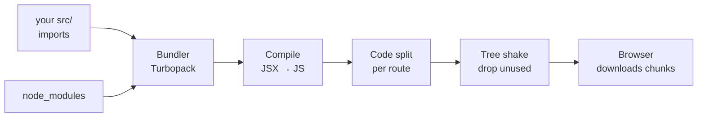

# Verbal segments — the workshop's connective tissue

The demos are the spine of Day 3, but the bits between them are where the picture comes together. These short reads are the conceptual bridges — the tooling under your feet, the platform around you, the styling on top, and the homework that ties it all together. Treat them as required reading between demos.

## Tooling break — Node, npm, and bundling

You've been writing JavaScript that runs *in the browser* all day. Now meet the plumbing that gets it there.

**Node.js.** JavaScript's engine is V8 — the thing inside Chrome that runs your scripts. **Node is V8 pulled out of the browser** and handed access to the filesystem and the network, so JavaScript can run as a server-side program. That's not abstract. When you run `next dev` to start the homework, you're starting a **Node process**. Your dev server *is* Node. There's no browser involved until you open a tab.

**npm, `package.json`, and `node_modules`.** npm is the package registry — the App Store for JavaScript libraries. `package.json` is your project's manifest: it lists every dependency you asked for, by name and version. When you run `npm install`, npm reads that list, downloads each library *and everything those libraries depend on*, and writes the whole tree into a folder called `node_modules`.

Open `node_modules` once and you'll see 50,000 files for a basic app. Don't panic — that's normal. It's every dependency-of-a-dependency-of-a-dependency. And don't commit it; it's in `.gitignore` for a reason. `package.json` is the recipe. `node_modules` is the groceries. You ship the recipe; anyone can re-fetch the groceries with one command.

**Bundling.** Here's the problem. In your code you write `import { Button } from './button'` and `import React from 'react'`. The **browser can't follow those** — it has no idea where `./button` lives on disk, and it certainly can't go rummaging through `node_modules`. So before the browser ever sees your code, a **bundler** (Next.js uses Turbopack) starts at your entry point, **traces every import** into a dependency graph, and stitches it all into a small handful of files the browser *can* load.

Three things the bundler does along the way:

1. **Compilation.** Your JSX/TSX isn't valid JavaScript. The bundler runs it through SWC to turn `<Card />` into plain function calls the browser understands.
2. **Code splitting.** It doesn't ship one giant file. It cuts per-route chunks so visiting `/restaurants` only downloads the code that page needs.
3. **Tree shaking.** If you import one function from a library and never use the rest, the bundler strips the unused code so it never ships.

Next.js does all of this automatically — you'll never hand-configure a bundler in this course. But understanding what it's doing is exactly how you diagnose a slow production page: a fat bundle, a route that wasn't split, dead code that didn't get shaken out.



## Platform tour — what the browser gives you for free

The browser isn't just a document viewer. It's an application runtime with a massive built-in API surface. Before you reach for a library, check whether the browser already does it. It usually does. Here's the short list of APIs you'll meet in the homework or in your first job:

- **fetch** — the modern way to make HTTP requests. `fetch('/api/restaurants').then(r => r.json())`. Reach for it any time you need to talk to a backend.
- **localStorage** — a synchronous key-value store that survives refreshes. Perfect for "remember the user's last search" or a cart that should outlive a page reload.
- **navigator.geolocation** — how Swiggy knows your location the moment you open the app. The browser asks the user for permission and hands the page their coordinates.
- **IntersectionObserver** — tells you when an element scrolls into the viewport. This is how the restaurant list lazy-loads images: don't download the picture until the card is about to be on screen.
- **WebSocket** — a two-way pipe that stays open. Live order tracking, support chat, stock tickers — anything the server needs to push to the client the moment it happens, no refresh required.
- **Notifications** — the "Your order is on the way" banner that pops even when the tab isn't focused. One API call.
- **Service Worker** — a script that sits between your app and the network, caches everything, and serves the cached app when the user goes through a tunnel. This is what makes "offline mode" possible.
- **Web Worker** — moves heavy computation (sorting 10,000 restaurants, parsing a giant CSV) off the main thread so the UI stays responsive instead of freezing.
- **Canvas / WebGL** — a pixel drawing surface. The delivery map, charts, dataviz, games.

You don't need to learn all of these today. Bookmark this list and reach for it when you have a feature to build.

## CSS and styling — the third leg

You don't need to master CSS today. You need just enough to build the homework and to debug a layout when it goes sideways.

**The box model.** Every element on the page is a box, and every box has four layers, from the inside out: **content → padding → border → margin**. Content is the text or image. Padding is space *inside* the border. Border is the line. Margin is space *outside* the border that pushes other boxes away.

Open DevTools → Elements → hover an element. You'll see the box-model diagram: content in blue, padding in green, margin in orange. **Every layout bug you will ever hit comes back to this picture.** "Why is there a gap there?" Margin. "Why is the text touching the edge?" No padding. Learn to read this diagram and half of CSS debugging is done.

<svg width="600" height="240" xmlns="http://www.w3.org/2000/svg">
  <rect x="0" y="0" width="600" height="240" fill="#f5f5f5"/>
  <text x="300" y="25" font-family="ui-sans-serif" font-size="13" font-weight="600" text-anchor="middle" fill="#171717">The box model</text>
  <rect x="100" y="50" width="400" height="160" fill="#fde8d4" stroke="#fc8019" stroke-width="1" stroke-dasharray="4,3"/>
  <text x="115" y="68" font-family="ui-sans-serif" font-size="11" fill="#fc8019">margin</text>
  <rect x="150" y="80" width="300" height="100" fill="#ffffff" stroke="#171717" stroke-width="2"/>
  <text x="165" y="98" font-family="ui-sans-serif" font-size="11" fill="#171717">border</text>
  <rect x="180" y="105" width="240" height="50" fill="#f5f5f5" stroke="#a3a3a3" stroke-width="1" stroke-dasharray="3,3"/>
  <text x="195" y="121" font-family="ui-sans-serif" font-size="11" fill="#a3a3a3">padding</text>
  <rect x="240" y="120" width="120" height="20" fill="#fc8019"/>
  <text x="300" y="135" font-family="ui-sans-serif" font-size="11" text-anchor="middle" fill="#ffffff">content</text>
</svg>

**Flexbox.** A one-dimensional layout — a row or a column. It's how you line things up, and crucially how you center things (the eternal CSS struggle):

```css
display: flex;
align-items: center;      /* center on the cross axis */
justify-content: center;  /* center on the main axis */
```

Those three lines center anything inside anything. Memorize them.

**Grid.** Flexbox's two-dimensional sibling — rows *and* columns at once. When you build the restaurant listing in the homework, that wall of cards is a Grid: define your columns once, drop the cards in, and they flow into a neat responsive matrix.

**Tailwind.** Instead of writing CSS in a separate file, Tailwind gives you utility classes you put directly on the element: `flex items-center p-4 bg-gray-100`. Each class is one tiny style — `p-4` is padding, `flex` is `display:flex`, and so on. It looks ugly and wrong the first time — *why is there a paragraph of class names on my div?* — but it works great, you stop inventing class names, and the styles live right next to the markup. You'll use Tailwind in the homework.

**Bottom line.** Don't try to master CSS today. Use AI to generate your styles — it's genuinely good at it. But understand the **box model** and **Flexbox** yourself, because those are the two things you'll need to *debug* what the AI gives you.

## Homework — build a small Swiggy-style restaurant discovery app

Build a small restaurant discovery app in **Next.js (App Router)**, deploy it to **Vercel**, and submit a live URL. This is the stack from Demos 7 and 8 — server components, client components, the App Router.

**What it needs:**

- A **listing page at `/`** — a grid of restaurant cards. Each card has an emoji or placeholder image, the restaurant name, a list of cuisines, a rating, and a delivery time.
- A **search filter** at the top of the listing page — type into the box and the cards filter live to those matching the name or cuisine. This is the one piece that *has* to be a client component (it needs state and `onChange`); think about why.
- A **detail page at `/restaurants/[id]`** — clicking a card lands the user on that restaurant's page with the full info and a (fake) menu of a few items. Use a dynamic route segment.
- **Hardcoded data.** No backend, no database. A 15-restaurant array in `lib/data.ts` that both pages import. Swiggy-style: Meghana Foods, Truffles, Empire, Glen's Bakehouse, A2B, etc.
- **Styled with Tailwind.** Don't over-design. Clean grid, readable cards, hover state on the cards.
- **Deployed to Vercel** with a working public link. Push to GitHub, import the repo on Vercel, ship it.

**Acceptance criteria — your app passes if:**

1. The listing page loads at the deployed URL and shows all 15 restaurants in a responsive grid.
2. Typing in the search box filters the visible cards as you type.
3. Clicking a card navigates to `/restaurants/[id]` and shows that restaurant's detail.
4. A Lighthouse Performance score of 90+ on the deployed URL (in Incognito, mobile). Next.js gives you this almost for free if you don't fight it.
5. You can answer three questions about **every page** you wrote: *what rendering strategy is this — SSG, SSR, or CSR? Is this a server component or a client component? Where does the HTML actually get built?*

Use AI freely to generate the code. But for every piece it gives you, you must be able to answer those three questions. If you can't, you don't understand what you shipped — and that's the entire point of today.

A reference implementation will be pushed to the Day-3 branch after the workshop so you can check your answers against ours. Don't peek until you've tried it yourself.

## 60-second recap

The whole day in one breath. You type a URL. The browser makes a **request**, gets HTML back, parses it into the **DOM** (a tree of objects), applies CSS to style that tree, runs **layout** to figure out where every box goes, then **paints** pixels to the screen. **JavaScript** can mutate the DOM, but every change forces re-layout and re-paint — that's expensive, which is why **React** keeps a lightweight copy (the **virtual DOM**), diffs it against the previous version, and tells the real DOM only the minimal set of changes. Then *where* the HTML gets built: **SSG** builds it once at deploy, **SSR** builds it per request on the server, **CSR** builds it in the browser. **Next.js** mixes all three on the same site — server components for data, client components for interactivity. Your first load arrives server-rendered (fast and crawlable), then React **hydrates** it in the browser so it becomes interactive.

The quick-reference card:

- **Demo 1 — Anatomy of a Page Load.** Network tab is your X-ray. HTML arrives first, then CSS, then JS, then images.
- **Demo 2 — The DOM is not the HTML.** HTML is the frozen text from the server. DOM is the live tree the browser is holding. JS only ever edits the DOM.
- **Demo 3 — Where you put your `<script>` matters.** Blocking scripts in `<head>` freeze first paint. `defer` and bottom-of-body fix it.
- **Demo 4 — How CSS actually applies.** Cascade, specificity, inheritance — the rules that decide which color wins.
- **Demo 5 — Layout and paint.** Browsers do *layout* (positions and sizes) and then *paint* (pixels). Layout-changing CSS is expensive; transform and opacity are cheap.
- **Demo 6 — The virtual DOM.** React's trick: diff a cheap JS object tree, only touch the real DOM at the leaves.
- **Demo 7 — SSG, SSR, CSR.** Three places HTML can be built — at deploy, per request, or in the browser. Each has tradeoffs.
- **Demo 8 — Next.js mixes all three.** Server components for data, client components for interactivity, hydration to glue them together.
- **Demo 8.5 — Streaming and Suspense.** Send the fast parts first, stream the slow parts in. The user sees something *now*.
- **Demo 9 — Lighthouse and Core Web Vitals.** LCP, INP, CLS — the three numbers Google ranks on. Measure your homework before you submit it.
